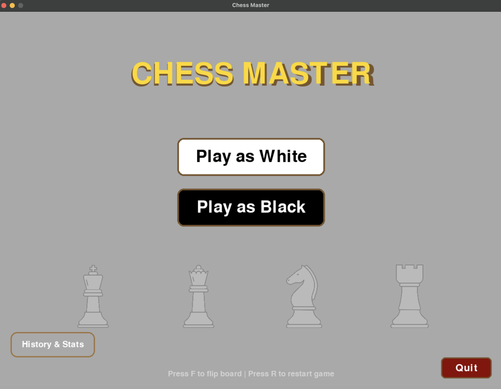

# Chess960 WZ — Fischer Random Chess in Python + Pygame

[](LICENSE)

Chess960 WZ is a local two-player Fischer Random Chess (Chess960) desktop application. At the start of every game the back-rank is randomised using the official 5-step combinatorial algorithm (4 × 4 × 6 × 10 × 1 = 960 unique arrangements), and the resulting position is identified by its Scharnagl SP-number (0–959; SP-518 = the standard arrangement). The rule engine — extracted into a UI-free `chess_core/` package — enforces the full move set: Chess960-aware castling, en passant, pawn promotion, check, checkmate, stalemate, the 50-move rule, threefold-repetition detection, and insufficient-material detection. Every completed game is logged to CSV, exported as a standard PGN (compatible with Lichess and Chess.com), and visualised through an in-app analytics dashboard with seven dynamic chart types. No internet connection, no account, no external engine required.

- **Stack** — Python 3.11 · Pygame 2.6.1 · pandas 2.2.3 · matplotlib 3.9.2 · pytest 9.0.2 · Hypothesis 6.112.0 · python-chess 1.11.2 (dev/test) · ruff 0.6.9 (lint)

---

## Screenshots

| Gameplay | Main Menu |
| --- | --- |
|  |  |

| Time Select | Resign Dialog |
| --- | --- |
|  |  |

| Dashboard Overview | Piece Dependency |
| --- | --- |
|  |  |

| Think Time by Phase | Capture Hesitation |
| --- | --- |
|  |  |

**Video demo** — [YouTube presentation](https://youtu.be/vuvZLTAKJtE) (game walk-through · analytics · class design overview)

---

## What it is

Chess960 WZ addresses two problems at once: opening memorisation dominates casual chess, and players have no easy way to see their own decision patterns per move. By randomising the back-rank at game start and logging every half-move with a timestamp, it forces calculation from move one and turns each completed game into immediate feedback.

- **Who it is for** — chess players who want to train calculation without relying on opening preparation, and data-curious players who want their playstyle quantified.
- **Author** — Phasathat Jaruchitsophon (6610545375)
- **Repo** — [github.com/Tasachii/Chess960WZ](https://github.com/Tasachii/Chess960WZ)
- **Documents** — [Proposal (PDF)](proposal.pdf) · [UML Class Diagram (PDF)](uml.pdf)

---

## Installation

**Requirements** — [Python 3.11+](https://www.python.org/downloads/)

**Mac / Linux**
```bash
git clone https://github.com/Tasachii/Chess960WZ.git
cd Chess960WZ
python3 -m venv .venv
source .venv/bin/activate
pip install -e ".[dev]"   # installs runtime + pytest/hypothesis/ruff/python-chess
```

**Windows**
```bat
git clone https://github.com/Tasachii/Chess960WZ.git
cd Chess960WZ
python -m venv .venv
.venv\Scripts\activate
pip install -e ".[dev]"   :: installs runtime + pytest/hypothesis/ruff/python-chess
```

For runtime-only (no dev tools):

**Mac / Linux**
```bash
pip install -r requirements.txt   # pygame · pandas · matplotlib
```

**Windows**
```bat
pip install -r requirements.txt   :: pygame · pandas · matplotlib
```

> The `images/` folder containing piece sprites must be present beside `main.py`. If sprites are missing the game continues with text placeholders.

---

## Running

```bash
python main.py        # launch the game (Mac / Linux: python3 main.py)
```

---

## Usage

1. **Main menu.** Choose to play as White or Black, or open **History & Stats**.
2. **Time control.** Pick Bullet (1 min) · Blitz (3 min) · Rapid (10 min) · Classical (30 min).
3. **Select a piece.** Click one of your pieces — valid destination squares appear as dots.
4. **Move.** Click a highlighted square to execute the move.
5. **Chess960 castling.** Click the king, then click the castling-target square shown by the marker. The king lands on the c- or g-file; the rook lands on the d- or f-file regardless of its starting square.
6. **Pawn promotion.** The promotion dialog opens automatically when a pawn reaches the back rank. Click the desired piece.
7. **Board flip.** Press **F** to flip the board — useful when two players share one keyboard.
8. **Return to menu.** Press **R** mid-game.
9. **Resign.** Click the **Resign** button under either side's label to end the game immediately.
10. **Game over.** Result and PGN are saved automatically to `pgn_files/`. Press **Enter** to start a new game with a fresh Chess960 position.
11. **History & Stats.** Open from the main menu. Shows per-game summary statistics and a recent-game log (winner · duration · move count · time control).
12. **Analytics Dashboard.** Open from inside History & Stats. Switch between seven chart types and filter by side (White / Black / Both).

### Dashboard chart types

| Chart | What it shows |
| --- | --- |
| Piece Dependency | Share of total moves by piece type — reveals over-reliance on one piece |
| Capture Hesitation | Average think time before capturing, broken down by attacking piece |
| Think Time by Phase | Average think time per move across Opening · Middlegame · Endgame |
| Lethality Matrix | Which pieces capture which opponent pieces most often |
| Win Rates | White wins · Black wins · Draws across all recorded games |
| Duration Distribution | Histogram of game durations in minutes |
| Move Count Trend | Total half-moves per game over time |

---

## Architecture

The codebase is split into a pure logic layer and a render layer so the rule engine can be tested without a display.

| Topic | Decision |
| --- | --- |
| `chess_core/` package | Pure Python, no `import pygame`. Contains `CoreBoard`, `PieceCore` hierarchy, SP-number mapping. Imported by tests directly. |
| `chess_board.py` / `chess_piece.py` | Pygame render layer — subclass `chess_core` types and add only drawing. Never tested in isolation. |
| `chess_game.py` | Top-level controller: game loop, screen routing (menu → time-select → playing → history → chart viewer), turn state, input handling, orchestration of move pipeline. Never reaches into board internals. |
| `chess960_generator.py` | Stateless utility. Produces a back-rank via the 5-step algorithm and emits a Shredder-FEN castling field derived from the actual rook files (e.g. back-rank `nrkrbqbn` → castling field `DBdb`). |
| `pgn_exporter.py` | Converts per-move coordinate tuples to standard algebraic notation; writes a `.pgn` with `[Variant "Chess960"]` and `[FEN "..."]` headers. |
| `chess_statistics.py` | Appends one row per half-move to `statistics/moves_detail.csv` and one row per game to `statistics/games_history.csv`; renders the seven dashboard charts via pandas + matplotlib. |
| `chess_core/sp_number.py` | Scharnagl SP-number ↔ back-rank bijection, cross-checked against `python-chess` for all 960 positions. SP-518 = standard `RNBQKBNR`. |
| Legacy modules (ruff ignores) | `chess_game.py`, `chess_board.py`, `chess_statistics.py` predate the `chess_core` extraction and use `from constants import *`. They are excluded from strict ruff checks; new code stays fully strict. |

### Class relationships (from UML)

- **Composition** — `ChessGame` owns one `ChessBoard`; `ChessBoard` owns an 8×8 grid of `Square` objects; `ChessGame` owns one `ChessStatistics` and one `PGNExporter`.
- **Inheritance** — `ChessPiece` is the abstract base; `Pawn`, `Rook`, `Knight`, `Bishop`, `Queen`, `King` each inherit from it and override `get_valid_moves()`. `Pawn` additionally overrides `get_attack_squares()` — its capture diagonals differ from its move squares, which matters for correct castling validation.
- **Association** — `Square` references the `ChessPiece` currently occupying it; `Chess960Generator` is a stateless utility called by `ChessGame` at game start.

---

## Testing

```bash
python -m pytest                          # run all 1063 tests (fast subset; slow excluded by default)
python -m pytest -m slow                  # include the perft depth-3 and uniformity suites
coverage run -m pytest && coverage report # branch coverage for chess_core · chess960_generator · pgn_exporter
ruff check .                              # lint
```

The suite has 1063 collected tests across 7 files:

| File | Tests | What it covers |
| --- | --- | --- |
| `test_generator.py` | 11 | Property tests (Hypothesis, 300 examples each) · completeness (exactly 960) · Shredder-FEN correctness · python-chess round-trip |
| `test_sp_number.py` | 966 | SP-number ↔ back-rank bijection · 960 parametrised cross-checks against `python-chess` · error handling |
| `test_rules.py` | 23 | En passant · Chess960 castling · pins · stalemate · checkmate · promotion · 50-move counter |
| `test_perft.py` | 10 | Perft depth 1–3 from standard start (20 / 400 / 8902) · 4 positions × depth 1–2 cross-checked against `python-chess` (chess960=True) |
| `test_draws.py` | 14 | Threefold-repetition detection · insufficient-material (K vs K, K+B vs K, K+N vs K, K+B vs K+B same color) · 2000-position bulk differential vs python-chess |
| `test_pgn.py` | 9 | PGN round-trip and header correctness |
| `test_game.py` | 30 | Integration tests across the game state machine |

Coverage is enforced at ≥ 90 % branch coverage (scoped to `chess_core/`, `chess960_generator.py`, `pgn_exporter.py`); the suite currently reports **96 %**.

Slow tests (marked `@pytest.mark.slow`) include perft depth-3 and the 96 000-sample uniformity check; they are excluded from the default CI run via `-m "not slow"`.

---

## Data files

| File | One row per | Key columns |
| --- | --- | --- |
| `statistics/games_history.csv` | Completed game | `game_id` · `timestamp` · `winner` · `duration` · `total_moves` · `white_captures` · `black_captures` · `check_events` · `game_type` |
| `statistics/moves_detail.csv` | Half-move | `game_id` · `move_number` · `piece_type` · `color` · `to_col` · `to_row` · `move_time` · `is_capture` · `is_check` · `is_castle` · `is_promotion` |
| `pgn_files/*.pgn` | Completed game | Full PGN with `[Variant "Chess960"]` and Shredder-FEN |

Both CSVs accumulate across sessions; the dashboard always reflects the full game history.

---

## External sources

| Library | Purpose | License |
| --- | --- | --- |
| [Pygame](https://www.pygame.org) | Game rendering and event framework | LGPL |
| [pandas](https://pandas.pydata.org) | CSV processing and aggregation | BSD |
| [matplotlib](https://matplotlib.org) | Chart generation for the dashboard | PSF / matplotlib |
| [python-chess](https://python-chess.readthedocs.io) | Cross-check reference for move generation and FEN validation (dev only) | GPL-3.0 |
| Chess piece images | Standard classic set | Public domain |
| [Fischer Random Chess numbering scheme](https://en.wikipedia.org/wiki/Fischer_random_chess_numbering_scheme) | SP-number algorithm reference | — |

---

## License

MIT © Phasathat Jaruchitsophon
